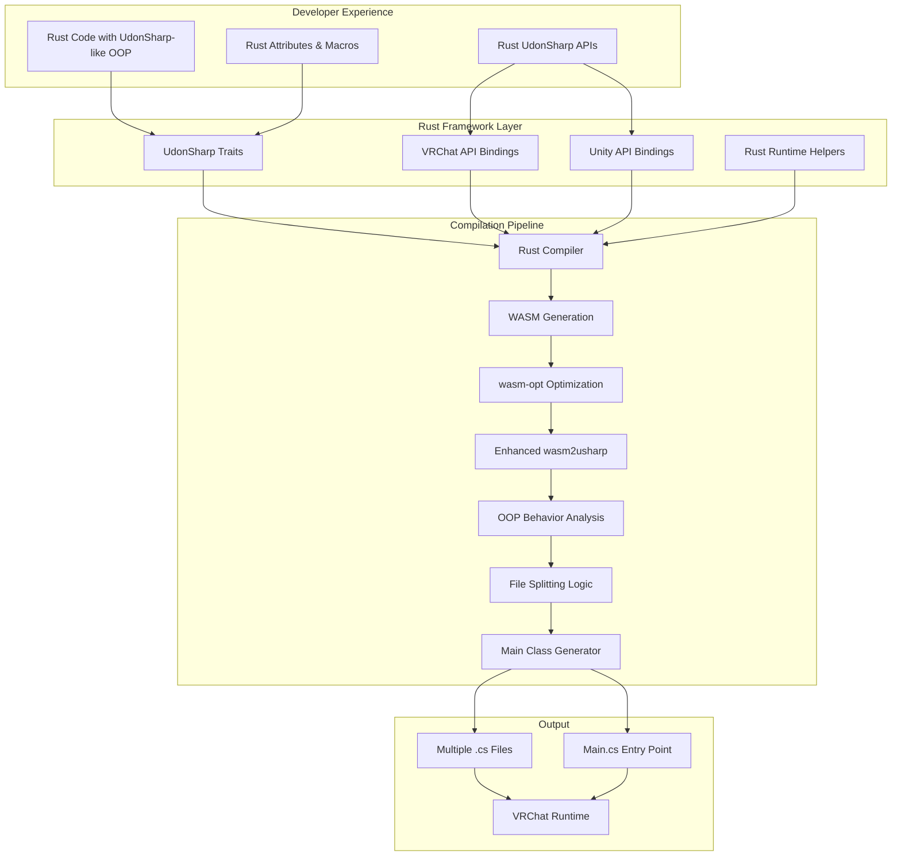

# Design Document

## Overview

This design outlines a Rust-based framework that provides UdonSharp-like object-oriented programming patterns for VRChat world development. The system allows developers to write Rust code with the same OOP capabilities as UdonSharp, then compiles it through WebAssembly to generate UdonSharp-compatible C# code. This creates a "Rust#" experience - Rust syntax with UdonSharp semantics.

The architecture leverages Rust's trait system, procedural macros, and the existing wasm2usharp infrastructure to provide a seamless development experience that feels like UdonSharp but with Rust's safety and expressiveness.

## Architecture

### High-Level Architecture



### Component Architecture

The system is organized into several key components:

1. **UdonSharp Traits**: Rust traits that mirror UdonSharp class capabilities and behaviors
2. **API Bindings**: Rust bindings for VRChat and Unity APIs that compile to appropriate UdonSharp calls
3. **Rust Runtime Helpers**: Utilities that provide UdonSharp-like functionality using Rust patterns
4. **Enhanced Compilation Pipeline**: 
   - Rust → WASM compilation with UdonSharp-specific optimizations
   - wasm-opt optimization for performance
   - Enhanced wasm2usharp with OOP behavior analysis
   - File splitting logic for modular C# output
   - Main class generation for entry point management

## Components and Interfaces

### UdonSharp Traits

The core UdonSharp-like programming experience is provided through Rust traits that mirror UdonSharp capabilities:

#### UdonBehaviour Trait
```rust
use udonsharp::*;

pub trait UdonBehaviour {
    fn start(&mut self) {}
    fn update(&mut self) {}
    fn on_player_joined(&mut self, player: VRCPlayerApi) {}
    fn on_player_left(&mut self, player: VRCPlayerApi) {}
}
```

#### UdonSharp Class Declaration
```rust
#[derive(UdonBehaviour)]
#[udon_sync_mode(Manual)]
pub struct MyWorldController {
    #[udon_public]
    pub world_name: String,
    
    #[udon_sync]
    pub player_count: i32,
    
    initialized: bool,
}

impl UdonBehaviour for MyWorldController {
    fn start(&mut self) {
        self.initialized = true;
        self.setup_world();
        
        if self.player_count > 0 {
            self.welcome_players();
        }
    }
}

impl MyWorldController {
    pub fn new() -> Self {
        Self {
            world_name: String::from("My World"),
            player_count: 0,
            initialized: false,
        }
    }
    
    fn setup_world(&mut self) {
        // World setup logic
    }
    
    fn welcome_players(&mut self) {
        // Player welcome logic
    }
}
```

### API Bindings Generation from .asmdef

The system automatically generates Rust bindings from Unity Assembly Definition (.asmdef) files, ensuring accurate and up-to-date API access:

#### Binding Generator Architecture

```rust
pub struct AsmdefParser {
    pub name: String,
    pub references: Vec<String>,
    pub included_platforms: Vec<String>,
    pub excluded_platforms: Vec<String>,
    pub allow_unsafe_code: bool,
}

pub struct BindingGenerator {
    parsers: Vec<AsmdefParser>,
    type_mappings: HashMap<String, String>,
    method_mappings: HashMap<String, String>,
}

impl BindingGenerator {
    pub fn from_asmdef_files(paths: &[&str]) -> Result<Self, BindingError> {
        let mut parsers = Vec::new();
        
        for path in paths {
            let asmdef_content = std::fs::read_to_string(path)?;
            let parser = AsmdefParser::parse(&asmdef_content)?;
            parsers.push(parser);
        }
        
        Ok(Self {
            parsers,
            type_mappings: Self::default_type_mappings(),
            method_mappings: Self::default_method_mappings(),
        })
    }
    
    pub fn generate_vrc_bindings(&self) -> Result<String, BindingError> {
        // Generate VRChat/Udon system bindings
    }
    
    pub fn generate_unity_bindings(&self) -> Result<String, BindingError> {
        // Generate Unity system bindings
    }
    
    pub fn generate_cs_bindings(&self) -> Result<String, BindingError> {
        // Generate C# system bindings
    }
}
```

#### Generated VRChat API Bindings

```rust
// Auto-generated from VRChat SDK .asmdef files
pub mod vrchat {
    use crate::types::*;
    
    // Generated from VRC.SDK3.dll
    pub struct Networking;
    
    impl Networking {
        #[udon_binding("VRCPlayerApi.LocalPlayer")]
        pub fn local_player() -> VRCPlayerApi {
            // Binding implementation
        }
        
        #[udon_binding("VRCPlayerApi.GetPlayers")]
        pub fn get_players() -> Vec<VRCPlayerApi> {
            // Binding implementation
        }
        
        #[udon_binding("Networking.IsOwner")]
        pub fn is_owner(player: &VRCPlayerApi) -> bool {
            // Binding implementation
        }
        
        #[udon_binding("Networking.SetOwner")]
        pub fn set_owner(player: &VRCPlayerApi, target: &GameObject) {
            // Binding implementation
        }
    }
    
    // Generated from VRC.Udon.dll
    pub struct UdonBehaviour;
    
    impl UdonBehaviour {
        #[udon_binding("UdonBehaviour.SendCustomEvent")]
        pub fn send_custom_event(&self, event_name: &str) {
            // Binding implementation
        }
        
        #[udon_binding("UdonBehaviour.SendCustomNetworkEvent")]
        pub fn send_custom_network_event(&self, target: NetworkEventTarget, event_name: &str) {
            // Binding implementation
        }
    }
}
```

#### Generated Unity API Bindings

```rust
// Auto-generated from Unity Engine .asmdef files
pub mod unity {
    use crate::types::*;
    
    // Generated from UnityEngine.CoreModule.asmdef
    pub struct GameObject {
        handle: ObjectHandle,
    }
    
    impl GameObject {
        #[udon_binding("GameObject.Find")]
        pub fn find(name: &str) -> Option<GameObject> {
            // Binding implementation
        }
        
        #[udon_binding("new GameObject")]
        pub fn new(name: &str) -> GameObject {
            // Binding implementation
        }
        
        #[udon_binding("GameObject.GetComponent")]
        pub fn get_component<T>(&self) -> Option<T> {
            // Binding implementation
        }
        
        #[udon_binding("GameObject.SetActive")]
        pub fn set_active(&mut self, active: bool) {
            // Binding implementation
        }
        
        #[udon_binding("GameObject.transform")]
        pub fn transform(&self) -> Transform {
            // Binding implementation
        }
    }
    
    // Generated from UnityEngine.CoreModule.asmdef
    pub struct Transform {
        handle: ObjectHandle,
    }
    
    impl Transform {
        #[udon_binding("Transform.position")]
        pub fn position(&self) -> Vector3 {
            // Binding implementation
        }
        
        #[udon_binding("Transform.set_position")]
        pub fn set_position(&mut self, position: Vector3) {
            // Binding implementation
        }
        
        #[udon_binding("Transform.Translate")]
        pub fn translate(&mut self, translation: Vector3) {
            // Binding implementation
        }
        
        #[udon_binding("Transform.Rotate")]
        pub fn rotate(&mut self, rotation: Vector3) {
            // Binding implementation
        }
    }
    
    // Generated from UnityEngine.AnimationModule.asmdef
    pub struct Animator {
        handle: ObjectHandle,
    }
    
    impl Animator {
        #[udon_binding("Animator.Play")]
        pub fn play(&mut self, state_name: &str) {
            // Binding implementation
        }
        
        #[udon_binding("Animator.GetCurrentAnimatorStateInfo")]
        pub fn get_current_animator_state_info(&self, layer_index: i32) -> AnimatorStateInfo {
            // Binding implementation
        }
    }
}
```

#### Generated C# System Bindings

```rust
// Auto-generated from .NET/C# system assemblies
pub mod cs_sys {
    use crate::types::*;
    
    // Generated from System.Collections.asmdef
    pub mod collections {
        pub struct List<T> {
            items: Vec<T>,
        }
        
        impl<T> List<T> {
            #[udon_binding("new List<T>")]
            pub fn new() -> Self {
                // Binding implementation
            }
            
            #[udon_binding("List<T>.Add")]
            pub fn add(&mut self, item: T) {
                // Binding implementation
            }
            
            #[udon_binding("List<T>.get_Item")]
            pub fn get(&self, index: usize) -> Option<&T> {
                // Binding implementation
            }
            
            #[udon_binding("List<T>.Count")]
            pub fn count(&self) -> usize {
                // Binding implementation
            }
        }
    }
    
    // Generated from UnityEngine.CoreModule.asmdef
    pub mod math {
        pub struct Mathf;
        
        impl Mathf {
            #[udon_binding("Mathf.Lerp")]
            pub fn lerp(a: f32, b: f32, t: f32) -> f32 {
                // Binding implementation
            }
            
            #[udon_binding("Mathf.Sin")]
            pub fn sin(f: f32) -> f32 {
                // Binding implementation
            }
            
            #[udon_binding("Mathf.Cos")]
            pub fn cos(f: f32) -> f32 {
                // Binding implementation
            }
            
            #[udon_binding("Mathf.Clamp")]
            pub fn clamp(value: f32, min: f32, max: f32) -> f32 {
                // Binding implementation
            }
        }
        
        pub struct Random;
        
        impl Random {
            #[udon_binding("UnityEngine.Random.value")]
            pub fn value() -> f32 {
                // Binding implementation
            }
            
            #[udon_binding("UnityEngine.Random.Range")]
            pub fn range_int(min: i32, max: i32) -> i32 {
                // Binding implementation
            }
            
            #[udon_binding("UnityEngine.Random.Range")]
            pub fn range_float(min: f32, max: f32) -> f32 {
                // Binding implementation
            }
        }
    }
    
    // Generated from System.asmdef
    pub mod time {
        pub struct Time;
        
        impl Time {
            #[udon_binding("UnityEngine.Time.time")]
            pub fn time() -> f32 {
                // Binding implementation
            }
            
            #[udon_binding("UnityEngine.Time.deltaTime")]
            pub fn delta_time() -> f32 {
                // Binding implementation
            }
            
            #[udon_binding("UnityEngine.Time.fixedTime")]
            pub fn fixed_time() -> f32 {
                // Binding implementation
            }
        }
    }
}
```

### Rust Runtime Helpers

#### Event System
```rust
use std::collections::HashMap;

pub struct UdonEventSystem {
    handlers: HashMap<String, Vec<Box<dyn Fn(&dyn std::any::Any)>>>,
}

impl UdonEventSystem {
    pub fn new() -> Self {
        Self {
            handlers: HashMap::new(),
        }
    }
    
    pub fn on<T: 'static>(&mut self, event_name: &str, handler: impl Fn(&T) + 'static) {
        let event_name = event_name.to_string();
        
        if !self.handlers.contains_key(&event_name) {
            self.handlers.insert(event_name.clone(), Vec::new());
        }
        
        let wrapped_handler = Box::new(move |data: &dyn std::any::Any| {
            if let Some(typed_data) = data.downcast_ref::<T>() {
                handler(typed_data);
            }
        });
        
        self.handlers.get_mut(&event_name).unwrap().push(wrapped_handler);
    }
    
    pub fn emit<T: 'static>(&self, event_name: &str, data: &T) {
        if let Some(handlers) = self.handlers.get(event_name) {
            for handler in handlers {
                handler(data as &dyn std::any::Any);
            }
        }
    }
}
```

#### UdonSharp Collections
```rust
pub struct UdonList<T> {
    items: Vec<T>,
}

impl<T> UdonList<T> {
    pub fn new() -> Self {
        Self { items: Vec::new() }
    }
    
    pub fn add(&mut self, item: T) {
        self.items.push(item);
    }
    
    pub fn get(&self, index: usize) -> Option<&T> {
        self.items.get(index)
    }
    
    pub fn len(&self) -> usize {
        self.items.len()
    }
    
    pub fn clear(&mut self) {
        self.items.clear();
    }
}

pub struct UdonDictionary<K, V> {
    items: HashMap<K, V>,
}

impl<K: Eq + std::hash::Hash, V> UdonDictionary<K, V> {
    pub fn new() -> Self {
        Self { items: HashMap::new() }
    }
    
    pub fn insert(&mut self, key: K, value: V) {
        self.items.insert(key, value);
    }
    
    pub fn get(&self, key: &K) -> Option<&V> {
        self.items.get(key)
    }
    
    pub fn contains_key(&self, key: &K) -> bool {
        self.items.contains_key(key)
    }
}
```

## Data Models

### Rust Type System

#### Core UdonSharp Types
```rust
// Basic types that map to UdonSharp equivalents
pub type UdonString = String;
pub type UdonInt = i32;
pub type UdonFloat = f32;
pub type UdonBool = bool;

// Unity types
#[repr(C)]
pub struct Vector3 {
    pub x: f32,
    pub y: f32,
    pub z: f32,
}

#[repr(C)]
pub struct Quaternion {
    pub x: f32,
    pub y: f32,
    pub z: f32,
    pub w: f32,
}

#[repr(C)]
pub struct Color {
    pub r: f32,
    pub g: f32,
    pub b: f32,
    pub a: f32,
}

// VRChat types
pub struct VRCPlayerApi {
    // Internal player handle
}

impl VRCPlayerApi {
    pub fn get_display_name(&self) -> String {
        // Compiles to player.displayName
    }
    
    pub fn is_local(&self) -> bool {
        // Compiles to Networking.IsOwner(player)
    }
    
    pub fn respawn(&self) {
        // Compiles to player.Respawn()
    }
}
```

#### UdonSharp Attribute System
```rust
// Procedural macros for UdonSharp attributes
#[proc_macro_derive(UdonBehaviour, attributes(udon_sync_mode, udon_public, udon_sync))]
pub fn derive_udon_behaviour(input: TokenStream) -> TokenStream {
    // Generate UdonSharp-compatible code
}

// Attribute macros
#[proc_macro_attribute]
pub fn udon_public(_args: TokenStream, input: TokenStream) -> TokenStream {
    // Mark field as public in generated UdonSharp
}

#[proc_macro_attribute]
pub fn udon_sync(_args: TokenStream, input: TokenStream) -> TokenStream {
    // Mark field for networking sync
}

#[proc_macro_attribute]
pub fn udon_event(args: TokenStream, input: TokenStream) -> TokenStream {
    // Mark method as UdonSharp event handler
}
```

### .asmdef Parsing and Binding Generation

#### Assembly Definition Parser

```rust
use serde::{Deserialize, Serialize};

#[derive(Debug, Clone, Deserialize, Serialize)]
pub struct AsmdefFile {
    pub name: String,
    pub references: Vec<String>,
    #[serde(rename = "includePlatforms")]
    pub include_platforms: Vec<String>,
    #[serde(rename = "excludePlatforms")]
    pub exclude_platforms: Vec<String>,
    #[serde(rename = "allowUnsafeCode")]
    pub allow_unsafe_code: bool,
    #[serde(rename = "overrideReferences")]
    pub override_references: bool,
    #[serde(rename = "precompiledReferences")]
    pub precompiled_references: Vec<String>,
}

impl AsmdefFile {
    pub fn parse(content: &str) -> Result<Self, serde_json::Error> {
        serde_json::from_str(content)
    }
    
    pub fn from_file(path: &str) -> Result<Self, Box<dyn std::error::Error>> {
        let content = std::fs::read_to_string(path)?;
        Ok(Self::parse(&content)?)
    }
}
```

#### Universal Binding Generation Pipeline

```rust
pub struct UniversalBindingPipeline {
    asmdef_directories: Vec<String>,
    output_dir: String,
    udonsharp_compatibility_checker: UdonSharpCompatibilityChecker,
}

impl UniversalBindingPipeline {
    pub fn new(output_dir: String) -> Self {
        Self {
            asmdef_directories: Vec::new(),
            output_dir,
            udonsharp_compatibility_checker: UdonSharpCompatibilityChecker::new(),
        }
    }
    
    pub fn add_asmdef_directory(&mut self, directory: String) {
        self.asmdef_directories.push(directory);
    }
    
    pub fn scan_and_generate_all_bindings(&self) -> Result<(), BindingError> {
        let mut discovered_asmdefs = Vec::new();
        
        // Scan all directories for .asmdef files
        for directory in &self.asmdef_directories {
            let asmdefs = self.discover_asmdef_files(directory)?;
            discovered_asmdefs.extend(asmdefs);
        }
        
        // Generate bindings for each discovered assembly
        for asmdef_path in discovered_asmdefs {
            let asmdef = AsmdefFile::from_file(&asmdef_path)?;
            
            // Check if this assembly is compatible with UdonSharp
            if self.udonsharp_compatibility_checker.is_compatible(&asmdef)? {
                let binding_code = self.generate_binding_for_assembly(&asmdef)?;
                let output_file = self.get_output_filename(&asmdef);
                let output_path = format!("{}/{}", self.output_dir, output_file);
                
                std::fs::write(output_path, binding_code)?;
                println!("Generated bindings for: {}", asmdef.name);
            } else {
                println!("Skipping incompatible assembly: {}", asmdef.name);
            }
        }
        
        // Generate a master mod.rs file that includes all generated bindings
        self.generate_master_module_file()?;
        
        Ok(())
    }
    
    fn discover_asmdef_files(&self, directory: &str) -> Result<Vec<String>, BindingError> {
        let mut asmdef_files = Vec::new();
        
        for entry in std::fs::read_dir(directory)? {
            let entry = entry?;
            let path = entry.path();
            
            if path.is_file() && path.extension().map_or(false, |ext| ext == "asmdef") {
                asmdef_files.push(path.to_string_lossy().to_string());
            } else if path.is_dir() {
                // Recursively search subdirectories
                let subdirectory_files = self.discover_asmdef_files(&path.to_string_lossy())?;
                asmdef_files.extend(subdirectory_files);
            }
        }
        
        Ok(asmdef_files)
    }
    
    fn generate_binding_for_assembly(&self, asmdef: &AsmdefFile) -> Result<String, BindingError> {
        let assembly_analyzer = AssemblyAnalyzer::new(&asmdef.name)?;
        let api_info = assembly_analyzer.extract_api_information()?;
        
        let mut binding_code = String::new();
        
        // Generate module header
        binding_code.push_str(&format!(
            "// Auto-generated bindings for {}\n",
            asmdef.name
        ));
        binding_code.push_str(&format!(
            "// Generated from: {}.asmdef\n\n",
            asmdef.name
        ));
        
        // Generate use statements
        binding_code.push_str("use crate::types::*;\n");
        binding_code.push_str("use crate::udon_binding;\n\n");
        
        // Generate bindings for each type in the assembly
        for type_info in api_info.types {
            if self.udonsharp_compatibility_checker.is_type_compatible(&type_info) {
                let type_binding = self.generate_type_binding(&type_info)?;
                binding_code.push_str(&type_binding);
                binding_code.push_str("\n\n");
            }
        }
        
        Ok(binding_code)
    }
    
    fn generate_type_binding(&self, type_info: &TypeInfo) -> Result<String, BindingError> {
        let mut binding = String::new();
        
        // Generate struct definition
        binding.push_str(&format!(
            "pub struct {} {{\n    handle: ObjectHandle,\n}}\n\n",
            type_info.name
        ));
        
        // Generate implementation block
        binding.push_str(&format!("impl {} {{\n", type_info.name));
        
        // Generate methods
        for method in &type_info.methods {
            if self.udonsharp_compatibility_checker.is_method_compatible(method) {
                let method_binding = self.generate_method_binding(method)?;
                binding.push_str(&format!("    {}\n", method_binding));
            }
        }
        
        // Generate properties
        for property in &type_info.properties {
            if self.udonsharp_compatibility_checker.is_property_compatible(property) {
                let property_bindings = self.generate_property_binding(property)?;
                binding.push_str(&property_bindings);
            }
        }
        
        binding.push_str("}\n");
        
        Ok(binding)
    }
    
    fn generate_method_binding(&self, method: &MethodInfo) -> Result<String, BindingError> {
        let rust_method_name = self.convert_to_rust_naming(&method.name);
        let parameters = self.convert_parameters(&method.parameters)?;
        let return_type = self.convert_return_type(&method.return_type)?;
        
        let binding_attribute = format!(
            "#[udon_binding(\"{}.{}\")]",
            method.declaring_type,
            method.name
        );
        
        let method_signature = if method.is_static {
            format!(
                "    {}\n    pub fn {}({}) -> {} {{\n        // Binding implementation\n    }}",
                binding_attribute,
                rust_method_name,
                parameters,
                return_type
            )
        } else {
            format!(
                "    {}\n    pub fn {}(&self, {}) -> {} {{\n        // Binding implementation\n    }}",
                binding_attribute,
                rust_method_name,
                parameters,
                return_type
            )
        };
        
        Ok(method_signature)
    }
    
    fn get_output_filename(&self, asmdef: &AsmdefFile) -> String {
        let sanitized_name = asmdef.name
            .to_lowercase()
            .replace(".", "_")
            .replace("-", "_");
        format!("{}.rs", sanitized_name)
    }
    
    fn generate_master_module_file(&self) -> Result<(), BindingError> {
        let mut mod_content = String::new();
        
        mod_content.push_str("// Auto-generated module file for all UdonSharp-compatible bindings\n\n");
        
        // Scan output directory for generated binding files
        for entry in std::fs::read_dir(&self.output_dir)? {
            let entry = entry?;
            let path = entry.path();
            
            if path.is_file() && path.extension().map_or(false, |ext| ext == "rs") {
                if let Some(filename) = path.file_stem() {
                    let module_name = filename.to_string_lossy();
                    if module_name != "mod" && module_name != "types" {
                        mod_content.push_str(&format!("pub mod {};\n", module_name));
                    }
                }
            }
        }
        
        let mod_path = format!("{}/mod.rs", self.output_dir);
        std::fs::write(mod_path, mod_content)?;
        
        Ok(())
    }
}
```

#### UdonSharp Compatibility Checker

```rust
pub struct UdonSharpCompatibilityChecker {
    allowed_types: HashSet<String>,
    allowed_namespaces: HashSet<String>,
    forbidden_features: HashSet<String>,
}

impl UdonSharpCompatibilityChecker {
    pub fn new() -> Self {
        let mut checker = Self {
            allowed_types: HashSet::new(),
            allowed_namespaces: HashSet::new(),
            forbidden_features: HashSet::new(),
        };
        
        checker.initialize_compatibility_rules();
        checker
    }
    
    fn initialize_compatibility_rules(&mut self) {
        // Add UdonSharp-compatible namespaces
        self.allowed_namespaces.insert("UnityEngine".to_string());
        self.allowed_namespaces.insert("VRC.SDKBase".to_string());
        self.allowed_namespaces.insert("VRC.SDK3".to_string());
        self.allowed_namespaces.insert("VRC.Udon".to_string());
        self.allowed_namespaces.insert("System".to_string());
        
        // Add forbidden features that UdonSharp doesn't support
        self.forbidden_features.insert("System.Threading".to_string());
        self.forbidden_features.insert("System.IO".to_string());
        self.forbidden_features.insert("System.Net".to_string());
        self.forbidden_features.insert("System.Reflection".to_string());
    }
    
    pub fn is_compatible(&self, asmdef: &AsmdefFile) -> Result<bool, BindingError> {
        // Check if assembly name suggests UdonSharp compatibility
        if asmdef.name.contains("Editor") || asmdef.name.contains("Test") {
            return Ok(false);
        }
        
        // Check if assembly references are compatible
        for reference in &asmdef.references {
            if self.forbidden_features.iter().any(|forbidden| reference.contains(forbidden)) {
                return Ok(false);
            }
        }
        
        // Additional compatibility checks can be added here
        Ok(true)
    }
    
    pub fn is_type_compatible(&self, type_info: &TypeInfo) -> bool {
        // Check if type namespace is allowed
        if let Some(namespace) = &type_info.namespace {
            if !self.allowed_namespaces.iter().any(|allowed| namespace.starts_with(allowed)) {
                return false;
            }
        }
        
        // Check for forbidden type features
        if type_info.is_generic && type_info.generic_constraints.len() > 0 {
            // UdonSharp has limited generic support
            return false;
        }
        
        true
    }
    
    pub fn is_method_compatible(&self, method: &MethodInfo) -> bool {
        // Check for unsupported method features
        if method.is_generic || method.has_ref_parameters || method.has_out_parameters {
            return false;
        }
        
        // Check parameter types
        for param in &method.parameters {
            if !self.is_parameter_type_compatible(&param.parameter_type) {
                return false;
            }
        }
        
        true
    }
    
    pub fn is_property_compatible(&self, property: &PropertyInfo) -> bool {
        self.is_parameter_type_compatible(&property.property_type)
    }
    
    fn is_parameter_type_compatible(&self, type_name: &str) -> bool {
        // List of UdonSharp-compatible types
        let compatible_types = [
            "bool", "byte", "sbyte", "short", "ushort", "int", "uint", 
            "long", "ulong", "float", "double", "char", "string",
            "Vector2", "Vector3", "Vector4", "Quaternion", "Color", "Color32",
            "GameObject", "Transform", "Component", "MonoBehaviour",
            "VRCPlayerApi", "UdonBehaviour"
        ];
        
        compatible_types.iter().any(|&compatible| type_name.contains(compatible))
    }
}

### Compilation Configuration

```rust
// Configuration for Rust to UdonSharp compilation
#[derive(Debug, Clone)]
pub struct UdonSharpConfig {
    pub namespace: Option<String>,
    pub sync_mode: UdonSyncMode,
    pub generate_debug_info: bool,
    pub optimize_for_performance: bool,
    pub target_udonsharp_version: String,
    pub asmdef_scan_directories: Vec<String>,
    pub custom_binding_rules: Option<String>,
}

impl UdonSharpConfig {
    pub fn with_unity_project(unity_project_path: &str) -> Self {
        let mut config = Self::default();
        
        // Automatically discover common Unity and VRChat SDK paths
        config.asmdef_scan_directories = vec![
            format!("{}/Library/PackageCache", unity_project_path),
            format!("{}/Assets", unity_project_path),
            format!("{}/Packages", unity_project_path),
        ];
        
        config
    }
    
    pub fn add_custom_library_path(&mut self, path: String) {
        self.asmdef_scan_directories.push(path);
    }
}

#[derive(Debug, Clone)]
pub enum UdonSyncMode {
    None,
    Manual,
    Continuous,
}

// Enhanced type mapping with .asmdef information
pub struct TypeMapper {
    rust_to_csharp: HashMap<String, String>,
    method_mappings: HashMap<String, String>,
    api_bindings: HashMap<String, ApiBinding>,
    assembly_info: HashMap<String, AsmdefFile>,
}

#[derive(Debug, Clone)]
pub struct ApiBinding {
    pub rust_path: String,
    pub csharp_equivalent: String,
    pub assembly_name: String,
    pub parameters: Vec<ParameterMapping>,
    pub return_type: Option<String>,
    pub udon_compatible: bool,
}

#[derive(Debug, Clone)]
pub struct ParameterMapping {
    pub rust_type: String,
    pub csharp_type: String,
    pub is_ref: bool,
    pub is_out: bool,
}

#### Assembly Analysis Data Structures

```rust
#[derive(Debug, Clone)]
pub struct AssemblyInfo {
    pub name: String,
    pub version: String,
    pub types: Vec<TypeInfo>,
    pub dependencies: Vec<String>,
}

#[derive(Debug, Clone)]
pub struct TypeInfo {
    pub name: String,
    pub namespace: Option<String>,
    pub full_name: String,
    pub is_public: bool,
    pub is_static: bool,
    pub is_generic: bool,
    pub generic_constraints: Vec<String>,
    pub base_type: Option<String>,
    pub interfaces: Vec<String>,
    pub methods: Vec<MethodInfo>,
    pub properties: Vec<PropertyInfo>,
    pub fields: Vec<FieldInfo>,
}

#[derive(Debug, Clone)]
pub struct MethodInfo {
    pub name: String,
    pub declaring_type: String,
    pub is_public: bool,
    pub is_static: bool,
    pub is_generic: bool,
    pub return_type: String,
    pub parameters: Vec<ParameterInfo>,
    pub has_ref_parameters: bool,
    pub has_out_parameters: bool,
}

#[derive(Debug, Clone)]
pub struct PropertyInfo {
    pub name: String,
    pub property_type: String,
    pub can_read: bool,
    pub can_write: bool,
    pub is_public: bool,
    pub is_static: bool,
}

#[derive(Debug, Clone)]
pub struct FieldInfo {
    pub name: String,
    pub field_type: String,
    pub is_public: bool,
    pub is_static: bool,
    pub is_readonly: bool,
}

#[derive(Debug, Clone)]
pub struct ParameterInfo {
    pub name: String,
    pub parameter_type: String,
    pub is_ref: bool,
    pub is_out: bool,
    pub has_default_value: bool,
    pub default_value: Option<String>,
}

pub struct AssemblyAnalyzer {
    assembly_name: String,
}

impl AssemblyAnalyzer {
    pub fn new(assembly_name: &str) -> Result<Self, BindingError> {
        Ok(Self {
            assembly_name: assembly_name.to_string(),
        })
    }
    
    pub fn extract_api_information(&self) -> Result<AssemblyInfo, BindingError> {
        // Use reflection or IL analysis to extract API information
        // This would typically use a .NET reflection library or IL parser
        // For now, this is a placeholder that would be implemented with
        // actual assembly analysis logic
        
        todo!("Implement actual assembly analysis using reflection or IL parsing")
    }
}

## Enhanced Compilation Pipeline

### Rust to WASM Compilation

```rust
pub struct RustToWasmCompiler {
    target_config: WasmTargetConfig,
    optimization_level: OptimizationLevel,
}

impl RustToWasmCompiler {
    pub fn new() -> Self {
        Self {
            target_config: WasmTargetConfig::udonsharp_compatible(),
            optimization_level: OptimizationLevel::Size,
        }
    }
    
    pub fn compile(&self, rust_source_dir: &str) -> Result<Vec<u8>, CompilationError> {
        // Configure Rust compiler for WASM target with UdonSharp constraints
        let mut cmd = std::process::Command::new("rustc");
        cmd.arg("--target").arg("wasm32-unknown-unknown");
        cmd.arg("--crate-type").arg("cdylib");
        cmd.arg("-O"); // Optimize for size
        cmd.arg("--cfg").arg("target_feature=\"+bulk-memory\"");
        
        // Add UdonSharp-specific compilation flags
        cmd.arg("--cfg").arg("udonsharp");
        cmd.arg("-C").arg("panic=abort");
        cmd.arg("-C").arg("opt-level=s");
        
        let output = cmd.output()?;
        
        if !output.status.success() {
            return Err(CompilationError::RustCompilation(
                String::from_utf8_lossy(&output.stderr).to_string()
            ));
        }
        
        // Read the generated WASM file
        std::fs::read("target/wasm32-unknown-unknown/release/output.wasm")
            .map_err(CompilationError::IoError)
    }
}

#[derive(Debug, Clone)]
pub struct WasmTargetConfig {
    pub enable_bulk_memory: bool,
    pub enable_sign_extension: bool,
    pub enable_mutable_globals: bool,
    pub disable_threads: bool,
    pub disable_simd: bool,
}

impl WasmTargetConfig {
    pub fn udonsharp_compatible() -> Self {
        Self {
            enable_bulk_memory: true,
            enable_sign_extension: true,
            enable_mutable_globals: true,
            disable_threads: true,
            disable_simd: true,
        }
    }
}
```

### WASM Optimization Pipeline

```rust
pub struct WasmOptimizer {
    optimization_passes: Vec<OptimizationPass>,
}

impl WasmOptimizer {
    pub fn new() -> Self {
        Self {
            optimization_passes: vec![
                OptimizationPass::DeadCodeElimination,
                OptimizationPass::FunctionInlining,
                OptimizationPass::ConstantFolding,
                OptimizationPass::UdonSharpSpecific,
            ],
        }
    }
    
    pub fn optimize(&self, wasm_bytes: &[u8]) -> Result<Vec<u8>, OptimizationError> {
        // Use wasm-opt for optimization
        let temp_input = tempfile::NamedTempFile::new()?;
        let temp_output = tempfile::NamedTempFile::new()?;
        
        std::fs::write(temp_input.path(), wasm_bytes)?;
        
        let mut cmd = std::process::Command::new("wasm-opt");
        cmd.arg("-Os"); // Optimize for size
        cmd.arg("--enable-bulk-memory");
        cmd.arg("--enable-sign-ext");
        cmd.arg("--enable-mutable-globals");
        cmd.arg("--disable-threads");
        cmd.arg("--disable-simd");
        
        // UdonSharp-specific optimizations
        cmd.arg("--remove-unused-functions");
        cmd.arg("--remove-unused-module-elements");
        cmd.arg("--optimize-level=3");
        
        cmd.arg("-o").arg(temp_output.path());
        cmd.arg(temp_input.path());
        
        let output = cmd.output()?;
        
        if !output.status.success() {
            return Err(OptimizationError::WasmOpt(
                String::from_utf8_lossy(&output.stderr).to_string()
            ));
        }
        
        std::fs::read(temp_output.path()).map_err(OptimizationError::IoError)
    }
}

#[derive(Debug, Clone)]
pub enum OptimizationPass {
    DeadCodeElimination,
    FunctionInlining,
    ConstantFolding,
    UdonSharpSpecific,
}
```

### Enhanced wasm2usharp with OOP Analysis

```rust
pub struct EnhancedWasm2USharp {
    oop_analyzer: OopBehaviorAnalyzer,
    file_splitter: FileSplitter,
    main_generator: MainClassGenerator,
    base_converter: wasm2usharp::Converter,
}

impl EnhancedWasm2USharp {
    pub fn new() -> Self {
        Self {
            oop_analyzer: OopBehaviorAnalyzer::new(),
            file_splitter: FileSplitter::new(),
            main_generator: MainClassGenerator::new(),
            base_converter: wasm2usharp::Converter::new(),
        }
    }
    
    pub fn convert(&self, wasm_bytes: &[u8], config: &ConversionConfig) -> Result<ConversionResult, ConversionError> {
        // Step 1: Analyze WASM for OOP patterns
        let oop_analysis = self.oop_analyzer.analyze(wasm_bytes)?;
        
        // Step 2: Convert WASM to initial C# code
        let initial_csharp = self.base_converter.convert(wasm_bytes, &config.base_config)?;
        
        // Step 3: Apply OOP transformations
        let oop_enhanced_csharp = self.apply_oop_transformations(&initial_csharp, &oop_analysis)?;
        
        // Step 4: Split into multiple files
        let split_files = self.file_splitter.split(&oop_enhanced_csharp, &config.splitting_config)?;
        
        // Step 5: Generate main class
        let main_class = self.main_generator.generate(&split_files, &config.main_config)?;
        
        Ok(ConversionResult {
            files: split_files,
            main_class,
            metadata: ConversionMetadata {
                oop_analysis,
                original_wasm_size: wasm_bytes.len(),
                generated_files_count: split_files.len(),
            },
        })
    }
    
    fn apply_oop_transformations(&self, csharp_code: &str, analysis: &OopAnalysis) -> Result<String, ConversionError> {
        let mut transformed = csharp_code.to_string();
        
        // Apply class structure transformations
        for class_info in &analysis.detected_classes {
            transformed = self.transform_class_structure(&transformed, class_info)?;
        }
        
        // Apply method transformations
        for method_info in &analysis.detected_methods {
            transformed = self.transform_method_structure(&transformed, method_info)?;
        }
        
        // Apply inheritance patterns
        for inheritance in &analysis.inheritance_patterns {
            transformed = self.apply_inheritance_pattern(&transformed, inheritance)?;
        }
        
        Ok(transformed)
    }
}

pub struct OopBehaviorAnalyzer {
    pattern_matchers: Vec<Box<dyn PatternMatcher>>,
}

impl OopBehaviorAnalyzer {
    pub fn new() -> Self {
        Self {
            pattern_matchers: vec![
                Box::new(ClassPatternMatcher::new()),
                Box::new(MethodPatternMatcher::new()),
                Box::new(InheritancePatternMatcher::new()),
                Box::new(InterfacePatternMatcher::new()),
            ],
        }
    }
    
    pub fn analyze(&self, wasm_bytes: &[u8]) -> Result<OopAnalysis, AnalysisError> {
        let mut analysis = OopAnalysis::new();
        
        // Parse WASM module
        let module = wasmparser::ModuleReader::new(wasm_bytes)?;
        
        // Analyze each section for OOP patterns
        for section in module {
            let section = section?;
            
            match section.code {
                wasmparser::SectionCode::Function => {
                    self.analyze_functions(&section, &mut analysis)?;
                }
                wasmparser::SectionCode::Export => {
                    self.analyze_exports(&section, &mut analysis)?;
                }
                wasmparser::SectionCode::Memory => {
                    self.analyze_memory_layout(&section, &mut analysis)?;
                }
                _ => {}
            }
        }
        
        // Apply pattern matching
        for matcher in &self.pattern_matchers {
            matcher.find_patterns(&mut analysis)?;
        }
        
        Ok(analysis)
    }
}

#[derive(Debug, Clone)]
pub struct OopAnalysis {
    pub detected_classes: Vec<ClassInfo>,
    pub detected_methods: Vec<MethodInfo>,
    pub inheritance_patterns: Vec<InheritancePattern>,
    pub interface_implementations: Vec<InterfaceImplementation>,
}

#[derive(Debug, Clone)]
pub struct ClassInfo {
    pub name: String,
    pub methods: Vec<String>,
    pub fields: Vec<FieldInfo>,
    pub is_udon_behaviour: bool,
    pub sync_mode: Option<String>,
}

#[derive(Debug, Clone)]
pub struct InheritancePattern {
    pub base_class: String,
    pub derived_class: String,
    pub virtual_methods: Vec<String>,
}
```

### File Splitting Logic

```rust
pub struct FileSplitter {
    splitting_strategy: SplittingStrategy,
}

impl FileSplitter {
    pub fn new() -> Self {
        Self {
            splitting_strategy: SplittingStrategy::ByClass,
        }
    }
    
    pub fn split(&self, csharp_code: &str, config: &SplittingConfig) -> Result<Vec<CSharpFile>, SplittingError> {
        match self.splitting_strategy {
            SplittingStrategy::ByClass => self.split_by_class(csharp_code, config),
            SplittingStrategy::ByNamespace => self.split_by_namespace(csharp_code, config),
            SplittingStrategy::BySize => self.split_by_size(csharp_code, config),
        }
    }
    
    fn split_by_class(&self, csharp_code: &str, config: &SplittingConfig) -> Result<Vec<CSharpFile>, SplittingError> {
        let mut files = Vec::new();
        let ast = self.parse_csharp(csharp_code)?;
        
        for class in ast.classes {
            let file_content = self.generate_class_file(&class, &config.namespace)?;
            
            files.push(CSharpFile {
                name: format!("{}.cs", class.name),
                content: file_content,
                class_type: ClassType::UdonBehaviour,
                dependencies: class.dependencies.clone(),
            });
        }
        
        Ok(files)
    }
    
    fn generate_class_file(&self, class: &ParsedClass, namespace: &Option<String>) -> Result<String, SplittingError> {
        let mut content = String::new();
        
        // Add using statements
        content.push_str("using UnityEngine;\n");
        content.push_str("using VRC.SDKBase;\n");
        content.push_str("using VRC.Udon;\n");
        content.push_str("using UdonSharp;\n\n");
        
        // Add namespace if specified
        if let Some(ns) = namespace {
            content.push_str(&format!("namespace {}\n{{\n", ns));
        }
        
        // Add class definition
        content.push_str(&format!("    [UdonBehaviourSyncMode(BehaviourSyncMode.{})]\n", 
                                 class.sync_mode.as_deref().unwrap_or("Manual")));
        content.push_str(&format!("    public class {} : UdonSharpBehaviour\n    {{\n", class.name));
        
        // Add fields
        for field in &class.fields {
            content.push_str(&format!("        {} {} {};\n", 
                                     field.visibility, field.field_type, field.name));
        }
        
        // Add methods
        for method in &class.methods {
            content.push_str(&self.generate_method_code(method)?);
        }
        
        content.push_str("    }\n");
        
        // Close namespace if specified
        if namespace.is_some() {
            content.push_str("}\n");
        }
        
        Ok(content)
    }
}

#[derive(Debug, Clone)]
pub enum SplittingStrategy {
    ByClass,
    ByNamespace,
    BySize,
}

#[derive(Debug, Clone)]
pub struct CSharpFile {
    pub name: String,
    pub content: String,
    pub class_type: ClassType,
    pub dependencies: Vec<String>,
}

#[derive(Debug, Clone)]
pub enum ClassType {
    UdonBehaviour,
    PlainClass,
    Interface,
    Struct,
}
```

### Main Class Generator

```rust
pub struct MainClassGenerator {
    template_engine: TemplateEngine,
}

impl MainClassGenerator {
    pub fn new() -> Self {
        Self {
            template_engine: TemplateEngine::new(),
        }
    }
    
    pub fn generate(&self, files: &[CSharpFile], config: &MainConfig) -> Result<CSharpFile, GenerationError> {
        let main_class_name = config.main_class_name.as_deref().unwrap_or("Main");
        
        let mut content = String::new();
        
        // Add using statements
        content.push_str("using UnityEngine;\n");
        content.push_str("using VRC.SDKBase;\n");
        content.push_str("using VRC.Udon;\n");
        content.push_str("using UdonSharp;\n\n");
        
        // Add namespace if specified
        if let Some(namespace) = &config.namespace {
            content.push_str(&format!("namespace {}\n{{\n", namespace));
        }
        
        // Generate main class
        content.push_str(&format!("    [UdonBehaviourSyncMode(BehaviourSyncMode.Manual)]\n"));
        content.push_str(&format!("    public class {} : UdonSharpBehaviour\n    {{\n", main_class_name));
        
        // Add references to other classes
        for file in files {
            if file.class_type == ClassType::UdonBehaviour {
                let class_name = self.extract_class_name(&file.name);
                content.push_str(&format!("        public {} {};\n", class_name, 
                                         self.to_camel_case(&class_name)));
            }
        }
        
        // Add initialization method
        content.push_str("\n        void Start()\n        {\n");
        content.push_str("            // Initialize all components\n");
        content.push_str("            InitializeComponents();\n");
        content.push_str("            \n");
        content.push_str("            // Call main entry point\n");
        content.push_str("            w2us_init();\n");
        
        if config.auto_start {
            content.push_str("            w2us_start();\n");
        }
        
        content.push_str("        }\n\n");
        
        // Add component initialization
        content.push_str("        private void InitializeComponents()\n        {\n");
        for file in files {
            if file.class_type == ClassType::UdonBehaviour {
                let class_name = self.extract_class_name(&file.name);
                let field_name = self.to_camel_case(&class_name);
                content.push_str(&format!("            if ({} == null)\n", field_name));
                content.push_str(&format!("                {} = GetComponent<{}>();\n", field_name, class_name));
            }
        }
        content.push_str("        }\n\n");
        
        // Add WASM entry points (generated by wasm2usharp)
        content.push_str("        // WASM entry points - generated by wasm2usharp\n");
        content.push_str("        public void w2us_init() { /* Generated initialization code */ }\n");
        content.push_str("        public void w2us_start() { /* Generated start code */ }\n");
        
        content.push_str("    }\n");
        
        // Close namespace if specified
        if config.namespace.is_some() {
            content.push_str("}\n");
        }
        
        Ok(CSharpFile {
            name: format!("{}.cs", main_class_name),
            content,
            class_type: ClassType::UdonBehaviour,
            dependencies: Vec::new(),
        })
    }
}

#[derive(Debug, Clone)]
pub struct ConversionResult {
    pub files: Vec<CSharpFile>,
    pub main_class: CSharpFile,
    pub metadata: ConversionMetadata,
}

#[derive(Debug, Clone)]
pub struct ConversionMetadata {
    pub oop_analysis: OopAnalysis,
    pub original_wasm_size: usize,
    pub generated_files_count: usize,
}
```

## Error Handling

### Compilation Error Management

The system provides comprehensive error handling during the Rust to UdonSharp compilation process:

```rust
#[derive(Debug, Clone)]
pub struct CompilationError {
    pub error_code: String,
    pub message: String,
    pub source_file: String,
    pub line_number: usize,
    pub column: usize,
    pub suggestion: Option<String>,
    pub severity: ErrorSeverity,
}

#[derive(Debug, Clone)]
pub enum ErrorSeverity {
    Info,
    Warning,
    Error,
    Critical,
}

pub struct ErrorHandler {
    errors: Vec<CompilationError>,
}

impl ErrorHandler {
    pub fn new() -> Self {
        Self { errors: Vec::new() }
    }
    
    pub fn add_error(&mut self, error: CompilationError) {
        self.errors.push(error);
    }
    
    pub fn has_errors(&self) -> bool {
        self.errors.iter().any(|e| matches!(e.severity, ErrorSeverity::Error | ErrorSeverity::Critical))
    }
    
    pub fn report_errors(&self) {
        for error in &self.errors {
            match error.severity {
                ErrorSeverity::Error | ErrorSeverity::Critical => {
                    eprintln!("Error: {} at {}:{}", error.message, error.source_file, error.line_number);
                }
                ErrorSeverity::Warning => {
                    println!("Warning: {} at {}:{}", error.message, error.source_file, error.line_number);
                }
                ErrorSeverity::Info => {
                    println!("Info: {}", error.message);
                }
            }
            
            if let Some(suggestion) = &error.suggestion {
                println!("  Suggestion: {}", suggestion);
            }
        }
    }
}
```

### Runtime Safety

```rust
// Safe wrappers for UdonSharp operations
pub trait UdonSafe<T> {
    fn udon_unwrap_or(self, default: T) -> T;
    fn udon_unwrap_or_else<F: FnOnce() -> T>(self, f: F) -> T;
}

impl<T> UdonSafe<T> for Option<T> {
    fn udon_unwrap_or(self, default: T) -> T {
        self.unwrap_or(default)
    }
    
    fn udon_unwrap_or_else<F: FnOnce() -> T>(self, f: F) -> T {
        self.unwrap_or_else(f)
    }
}

impl<T, E> UdonSafe<T> for Result<T, E> {
    fn udon_unwrap_or(self, default: T) -> T {
        self.unwrap_or(default)
    }
    
    fn udon_unwrap_or_else<F: FnOnce() -> T>(self, f: F) -> T {
        self.unwrap_or_else(|_| f())
    }
}
```

## Testing Strategy

### Rust Testing Framework

The system includes a comprehensive testing framework for Rust UdonSharp development:

```rust
#[cfg(test)]
mod tests {
    use super::*;
    use udonsharp_test::*;
    
    #[udon_test]
    fn test_world_controller_initialization() {
        let mut controller = MyWorldController::new();
        controller.start();
        
        assert_eq!(controller.initialized, true);
        assert_eq!(controller.world_name, "My World");
    }
    
    #[udon_test]
    fn test_vrchat_api_bindings() {
        // Test VRChat API functionality
        let local_player = vrchat::Networking::local_player();
        assert!(local_player.is_local());
        
        let world_name = vrchat::VRCWorld::get_world_name();
        assert!(!world_name.is_empty());
    }
    
    #[udon_test]
    fn test_unity_api_bindings() {
        // Test Unity API functionality
        let game_object = unity::GameObject::new("TestObject");
        assert_eq!(game_object.name(), "TestObject");
        
        let mut transform = game_object.transform();
        transform.position = Vector3::new(1.0, 2.0, 3.0);
        assert_eq!(transform.position.x, 1.0);
    }
}
```

### Integration Testing

```rust
#[cfg(test)]
mod integration_tests {
    use super::*;
    
    #[udon_integration_test]
    fn test_networking_sync() {
        let mut controller = MyWorldController::new();
        controller.player_count = 5;
        
        // Test that sync works correctly
        let synced_value = controller.get_synced_value("player_count");
        assert_eq!(synced_value, 5);
    }
    
    #[udon_integration_test]
    fn test_event_system() {
        let mut event_system = UdonEventSystem::new();
        let mut received_data = 0;
        
        event_system.on("test_event", |data: &i32| {
            received_data = *data;
        });
        
        event_system.emit("test_event", &42);
        assert_eq!(received_data, 42);
    }
}
```

### Performance Testing

```rust
use std::time::Instant;

pub struct UdonPerformanceMonitor {
    method_timings: HashMap<String, Vec<f64>>,
    call_counts: HashMap<String, usize>,
}

impl UdonPerformanceMonitor {
    pub fn new() -> Self {
        Self {
            method_timings: HashMap::new(),
            call_counts: HashMap::new(),
        }
    }
    
    pub fn time_method<T, F>(&mut self, method_name: &str, f: F) -> T
    where
        F: FnOnce() -> T,
    {
        let start = Instant::now();
        let result = f();
        let duration = start.elapsed().as_secs_f64();
        
        self.method_timings
            .entry(method_name.to_string())
            .or_insert_with(Vec::new)
            .push(duration);
            
        *self.call_counts
            .entry(method_name.to_string())
            .or_insert(0) += 1;
        
        result
    }
    
    pub fn generate_report(&self) -> PerformanceReport {
        let mut total_time = 0.0;
        let mut method_averages = HashMap::new();
        
        for (method, timings) in &self.method_timings {
            let average = timings.iter().sum::<f64>() / timings.len() as f64;
            method_averages.insert(method.clone(), average);
            total_time += timings.iter().sum::<f64>();
        }
        
        PerformanceReport {
            method_timings: self.method_timings.clone(),
            call_counts: self.call_counts.clone(),
            total_execution_time: total_time,
            method_averages,
        }
    }
}

#[derive(Debug)]
pub struct PerformanceReport {
    pub method_timings: HashMap<String, Vec<f64>>,
    pub call_counts: HashMap<String, usize>,
    pub total_execution_time: f64,
    pub method_averages: HashMap<String, f64>,
}
```

### Compilation Testing

```rust
#[cfg(test)]
mod compilation_tests {
    use super::*;
    
    #[test]
    fn test_rust_to_udonsharp_compilation() {
        let rust_source = r#"
            #[derive(UdonBehaviour)]
            pub struct TestBehaviour {
                #[udon_public]
                pub test_value: i32,
            }
            
            impl UdonBehaviour for TestBehaviour {
                fn start(&mut self) {
                    self.test_value = 42;
                }
            }
        "#;
        
        let compiled_result = compile_rust_to_udonsharp(rust_source);
        assert!(compiled_result.is_ok());
        
        let udonsharp_code = compiled_result.unwrap();
        assert!(udonsharp_code.contains("public int testValue"));
        assert!(udonsharp_code.contains("void Start()"));
    }
    
    #[test]
    fn test_api_binding_compilation() {
        let rust_source = r#"
            use vrchat::Networking;
            
            #[derive(UdonBehaviour)]
            pub struct NetworkTest {
                player_count: i32,
            }
            
            impl UdonBehaviour for NetworkTest {
                fn start(&mut self) {
                    let players = Networking::get_players();
                    self.player_count = players.len() as i32;
                }
            }
        "#;
        
        let compiled_result = compile_rust_to_udonsharp(rust_source);
        assert!(compiled_result.is_ok());
        
        let udonsharp_code = compiled_result.unwrap();
        assert!(udonsharp_code.contains("VRCPlayerApi.GetPlayers"));
    }
}
```

This design provides a comprehensive Rust-based framework that offers UdonSharp-like OOP capabilities while maintaining the safety and expressiveness of Rust. The system compiles Rust code through WebAssembly to generate UdonSharp-compatible C# classes, creating a "Rust#" development experience for VRChat world creation.